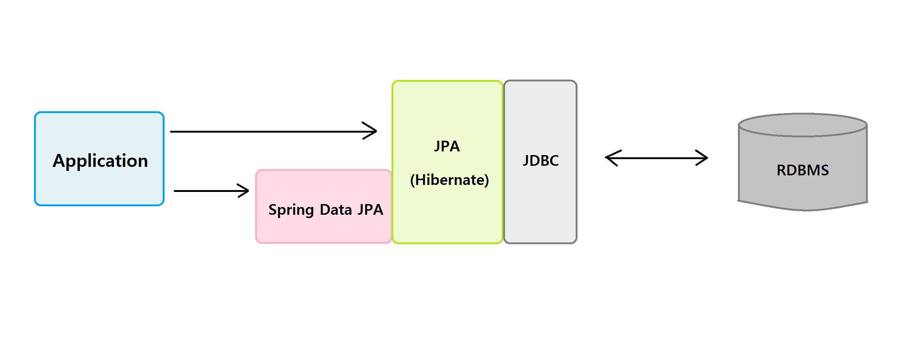
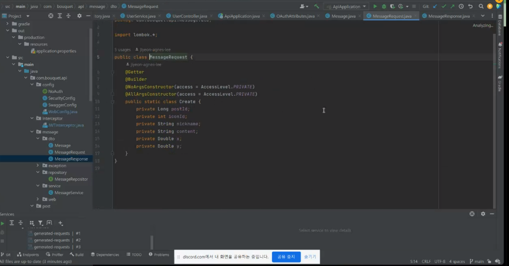
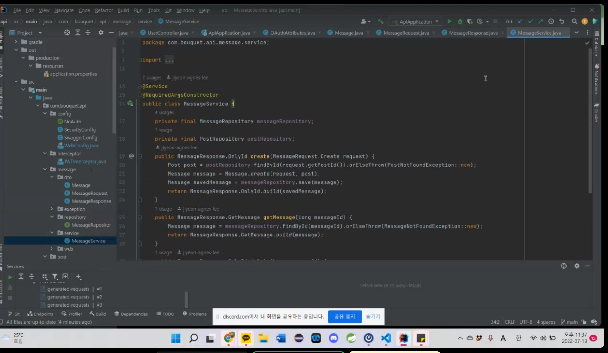

# JPA

## 이론

### 영속성의 이해

- 영속성은 사전적인 의미로 영원히 계속되는 성질이나 능력을 뜻함
- 물리적 저장소 (하드 디스크 or 테이프 etc) 에 저장하는 행위를 영속화라 표현한다.
- 자바에서 SQL을 통해 RDBMS에 데이터를 저장하는 행위를 영속화라 표현
- 객체지향 애플리케이션에서는 객체를 특정 저장소에 저장하는 행위를 영속화라 부른다.


- 자바에서는 다양한 방법으로 객체를 RDBMS로 영속화 한다.
- 솔루션(TopLink 또는 Hibernate)을 사용해서 객체를 RDBMS로 영속화 할 수 있다.
- Enterprise JavaBeans의 엔티티빈을 사용해서 객체를 RDBMS로 영속화 할 수 있다.
- 자바에서는 객체를 RDBMS에 영속화 할 때 일반적으로 OR 맵핑또는 SQL 맵핑을 사용한다.


- 자바에서는 직접적으로 데이터베이스의 프로토콜을 사용하는 대신 JDBC 인터페이스를 사용한다.
- JDBC 인터페이스는 자바와 데이터베이스를 연결하기 위한 기능을 정의한다.
- 데이터베이스 제조사는 JDBC 인터페이스를 자사 제품에 맞도록 구현한다.
- 다양한 벤더들 때문에 자바에서는 JDBC 인터페이스 정의만 제공한다.


### 객체의 세상과 테이블의 세상

- 객체 중심의 객체지향 애플리케이션과 테이블 중심의 관계형 데이터베이스는 서로의 목표가 다르다. (패러다임의 불일치)
- 이를 패러다임이 일치하지 않는다고 표현하며 이는 개발 과정에서 많은 비용을 발생하게 한다. 
- 영속적으로 데이터를 저장하기 위해 객체의 세상과 테이블의 세상을 서로 맞추는 과정이 필요

객체지향 -- 데이터의 최소단위 = 객체

| 객체지향 모델                 | 관계형 모델          |
| :---------------------------- | -------------------- |
| 객체, 클래스                  | 테이블, 로우         |
| 속성(attribute, property)     | 컬럼                 |
| Identity                      | Primaty Key          |
| Relationship/다른 엔터티 참조 | Foreign Key          |
| 상속/다형성                   | 없음                 |
| 매소드                        | SQL 로직, SP, 트리거 |
| 코드의 이식성                 | 벤더 종속적임        |

- 자바 어플리케이션에서 관계형 데이터베이스의 사용을 돕는 프레임워크를 Persistance Framework라 한다.
- Persistance Framework는 SQL Mapping (MyBatis)과 ORM(JPA)으로 구분한다
- SQL Mapping은 자바 코드와 SQL을 분리하며 개발자가 작성한 SQL의 수행 결과를 객체로 매핑한다.
- ORM은 객체와 관계형 데이터베이스 사이에서 매핑을 담당하여 SQL을 생성하여 패러다임의 불일치를 해결한다.


- JPA(Java Persistance API)은 자바 프로그램에서 관계형 데이터베이스에 접근하는 방식을 명세화한 인터페이스다.
- JPA는 ORM(Object-Relational Mapping) 기술 표준이며, 구현체로 Hibernate 라이브러리를 사용한다.
- Spring Data는 영속 데이터 관리를 위한 프로젝트이며 데이터의 저장 기술에 상관없이 다양하게 적용할 수 있다.
- Spring Data + JPA의 의미는 순수 JPA를 통한 데이터 관리에 Spring Data를 더해 좀더 쉽게 영속 데이터를 관리할 수 있도록 하는 것이다.



- 그러므로 Hibernate를 dependency로 추가해서 사용을 하게 된다.

## JPA 실습

**Spring MVC**

- 사용자 인터페이스, 데이터 및 논리 제어를 구현하는데 널리 사용되는 소프트웨어 디자인 패턴
- 소프트웨어의 비즈니스 로직과 화면을 구분하는데 중점
- Model, View, Controller로 분리하여 개발하는 디자인 패턴

Spring MVC 프레임워크를 이용하여 게시판을 만들어보자

- spring mvc 환경구축을 검색하면 첫번째로 build.gradle 파일을 수정을 하는 글들이 보였다.

  ***build.gradle\*** 파일을 살펴보자.

  - **# gradle build** 명령어로 인해 실행되는 파일
  - gradle 명령으로 수행하는 처리는 *build.gradle* 파일의 내용을 바탕으로 실행 된다.
    - **repositories** : gradle이 필요한 라이브러리를 자동으로 다운로드 하기위해 사용하는 저장소
      - 저장소 종류
        - **Maven** 중앙 저장소 : *mavenCentral()*
        - **JCenter** 저장소 : *jcenter()*
    - **Dependencies** : 저장소에서 필요한 라이브러리를 사용하기 위한 문장
      - 의존문 종류
        - **implementation ~** : 컴파일 시 의존하는(사용) 라이브러리를 지정
        - **testCompile ~** : 테스트 컴파일(단위테스팅)에 사용하는 라이브러리를 지정
        - **classpath ~** : 컴파일부터 실행 시까지 의존하는 라이브러리 지정에 사용

#### **Gradle과 Maven**

***Maven이란?***

Apache Maven은 자바용 프로젝트 관리 도구이다. 프로젝트 진행 시 자신이 작성한 코드 외에도 많은 라이브러리들을 활용해서 개발을 한다. 이 때 사용되는 라이브러리들의 수는 상당히 많아서 관리하기가 힘든데, 이러한 문제를 해결해주는 도구가 Maven이다. 즉, 프로젝트를 진행하면서 사용하는 많은 라이브러리들을 관리해주는 도구이다.

Maven은 특정 라이브러리가 작동하는데 필요한 다른 라이브러리들까지 관리하여 네트워크를 통해 자동으로 다운로드/업데이트 한다.

***Gradle이란?***

Gradle은 Groovy를 이용한 빌드 배포 도구(Build Tool)로 안드로이드 앱을 만들 때 필요한 공식 빌드시스템이다. Java, C/C++, Python 등과 같은 여러 가지 연어를 지원한다.

#### JPA

JPA 를 이용하여 DB의 값을 불러오기 위해 필요한 파일. 


1. Country.java -> 실제 database의 테이블과 매칭 될 클래스, Entity 생성

2. CountryController.java -> Data를 브라우저에서 요청하여 호출할 수 있도록 해주는 컨트롤러

3. CountryRepository.java -> DB Layer 접근하는 interface

4. application.properties ->  DB(MySQL) 연결정보가 적혀있음

5. CountryRepositoryTest.java -> DB가 잘 연동이 되었는지 jUnit 테스트 하기 위함

6. build.gradle -> gradle 로 JPA 모듈 불러오기


#### 프로젝트 생성하기

##### 1. Spring Starter Project 생성


#### 2. pom.xml

내 spring 버전의 dependency version 확인 필요

https://docs.spring.io/spring-boot/docs/current/reference/html/dependency-versions.html#appendix.dependency-versions

- 나는 2.7.1버전
- hibernate = 5.6.9.Final
- 


```
<!-- spring boot용 hibernate -->
		<dependency>
			<groupId>org.springframework.boot</groupId>
			<artifactId>spring-boot-starter-data-jpa</artifactId>
		</dependency>
```


### Maven

- resources

  - META_INF (추가로 만들어줘야한다 여기부터)

    - persistance.xml

      Maven의 경우 Hibernate가 정확히 이 위치에서 찾아서 온다.

- persistance.xml

```
<?xml version="1.0" encoding="UTF-8"?>
<persistence version="2.2"
             xmlns="http://xmlns.jcp.org/xml/ns/persistence" xmlns:xsi="http://www.w3.org/2001/XMLSchema-instance"
             xsi:schemaLocation="http://xmlns.jcp.org/xml/ns/persistence http://xmlns.jcp.org/xml/ns/persistence/persistence_2_2.xsd%22%3E
    <persistence-unit name="hello">
        <properties>
            <!-- 필수 속성 -->
            <property name="javax.persistence.jdbc.driver" value="org.h2.Driver"/>
            <property name="javax.persistence.jdbc.user" value="sa"/>
            <property name="javax.persistence.jdbc.password" value=""/>
            <property name="javax.persistence.jdbc.url" value="jdbc:h2:tcp://localhost/~/test"/>
            
            <!-- 각각 조금씩 상이한 애들을 거기에 맞춰주는 / dialect -->
            <property name="hibernate.dialect" value="org.hibernate.dialect.H2Dialect"/>
           

            <!-- 옵션 -->
            <!-- 어떤 SQL문을 던질지 보여주는 -->
            <property name="hibernate.show_sql" value="true"/>
            <!-- format은 줄바꿈 prettier같은 느낌 -->
            <property name="hibernate.format_sql" value="true"/>
            <!-- 어떤 format의 SQL을 던지는 건지 주석처리된 채로 보여주는 -->
            <property name="hibernate.use_sql_comments" value="true"/>
            <!--<property name="hibernate.jdbc.batch_size" value="10"/>-->
            <property name="hibernate.hbm2ddl.auto" value="create" />
        </properties>
    </persistence-unit>
</persistence>
```

- 실행을 했을 때, code 가 0이면 실행이 잘 되는거고 잘 안되면 1을 던짐
- 객체 생성 (Spring Starter로 치면 Dao 만들어)

```java
package com.testing.jpa.dto;

import javax.persistence.Column;
import javax.persistence.Entity;
import javax.persistence.Id;

@Entity //무조건 있어야 하는애
public class User {
	
	@Id //PK 지정
	private Long id; //long 기본 자료형 / Long 객체
	
    //@Column 어노테이션 같은 경우 사용하면 이것 저것 다양한거 할 수 있다. 예를들어 not null이나 unique나 그런 것들 다 지정하면서 사용 가능.
	@Column(name="name") // column어노테이션이 없어도 자동으로 column으로 들어간다.
	private String name; 

		
	public User() {
		super();
		// TODO Auto-generated constructor stub
	}

	public User(Long id) {
		this.id = id;
	}

	public Long getId() {
		return id;
	}

	public void setId(Long id) {
		this.id = id;
	}
	
	
	
}

```


- Controller에 작성 // springboot로 되어있는데 maven이라고 생각하고 읽어라.

```java
package com.testing.jpa;

import javax.persistence.EntityManager;
import javax.persistence.EntityManagerFactory;
import javax.persistence.EntityTransaction;
import javax.persistence.Persistence;

import org.springframework.boot.SpringApplication;
import org.springframework.boot.autoconfigure.SpringBootApplication;

import com.testing.jpa.dto.User;

@SpringBootApplication
public class TestMavenJpaApplication {

	public static void main(String[] args) {
		SpringApplication.run(TestMavenJpaApplication.class, args);
		EntityManagerFactory emf = Persistence.createEntityManagerFactory(persistenceUnitName);
		EntityManager em = emf.createEntityManager(); //요청이 들어올때마다 계속 생성
		// factory를 만들고 그 factory에서 entitymanager를 계속 생성
		
		//transaction도 객체를 만들어줘야해
		EntityTransaction tx = em.getTransaction();
		tx.begin(); //tx 시작
		
		//insert
		try {
			User user = new User();
			user.setId(2L); //자료형을 붙여서 Long으로 넣어달라.
			
			em.persist(user); //DB에 쌓아서 영속화
			
			//이전에는 관리만 하고 있다.
			tx.commit(); // commit 할 때 insert가 날아가
		} catch (Exception e) {
			// TODO: handle exception
			tx.rollback();
		} finally {
			em.close(); // 구문 끝날때 em 닫아주고,
		}
		
		//select //delete // update 전부 비슷하게 하면 된다.
		try {
			//이번엔 찾고 싶은 애를 em에서 가져온다.
			User finduser = em.find(User.class, 2L); // (앞은 User.class 자료 정보 / 뒤는 2L Id 값)
			
            //delete
            //finduser.remove();
            
            //update
            //finduser.setName(); // 이런식으로 바꾸면 됨
			
			em.persist(user); //DB에 쌓아서 영속화
			
			tx.commit();
		} catch (Exception e) {
			// TODO: handle exception
			tx.rollback();
		} finally {
			em.close(); // 구문 끝날때 em 닫아주고,
		}
		
		
		//맨 마지막에 factory도 닫아줘야함.
		emf.close();
		
	
	}

}

```


### Gradle


## 예시


### DTO


### REPOSITORY







